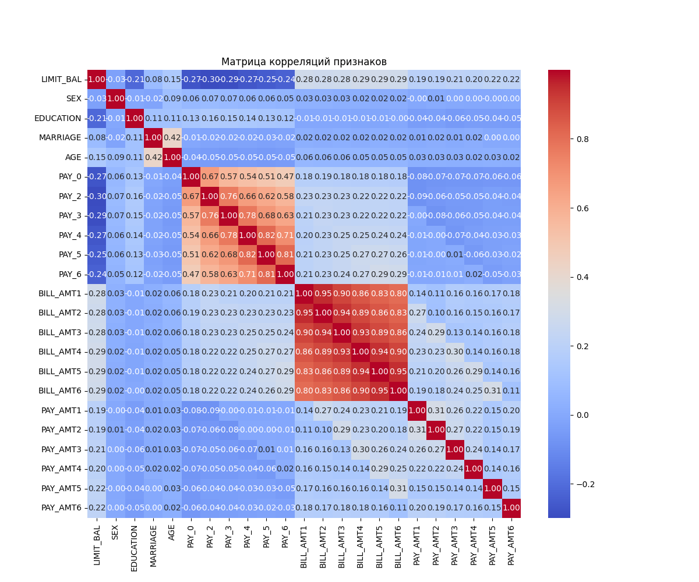
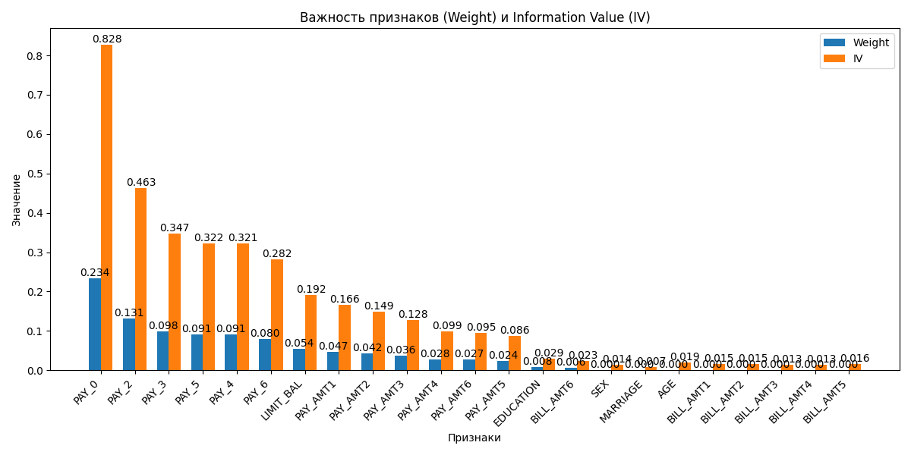
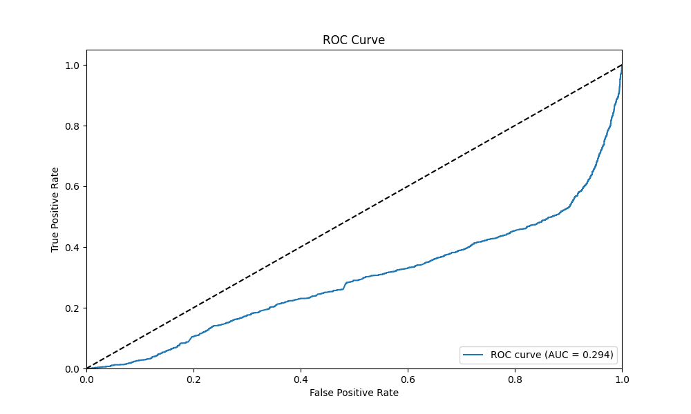
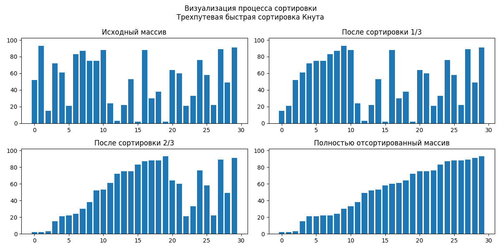
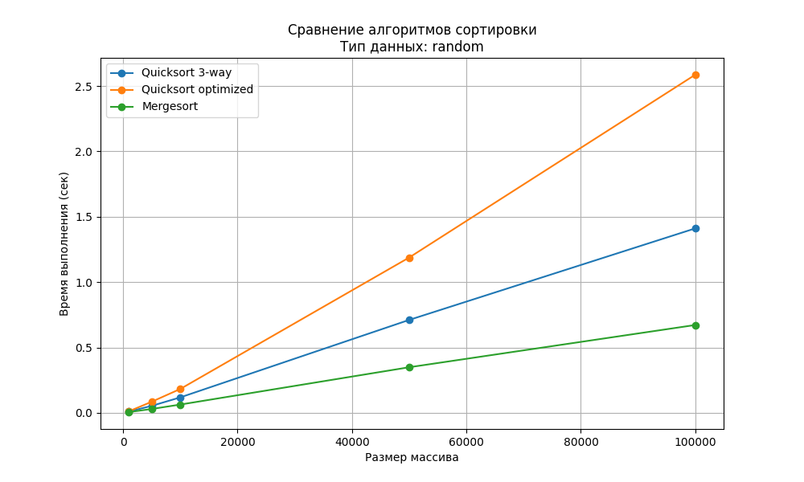
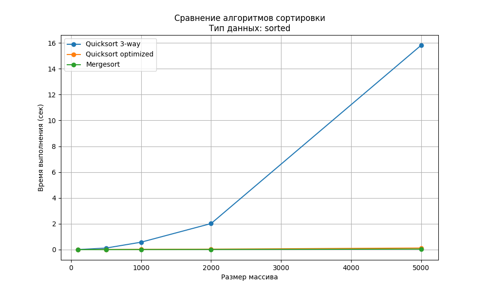
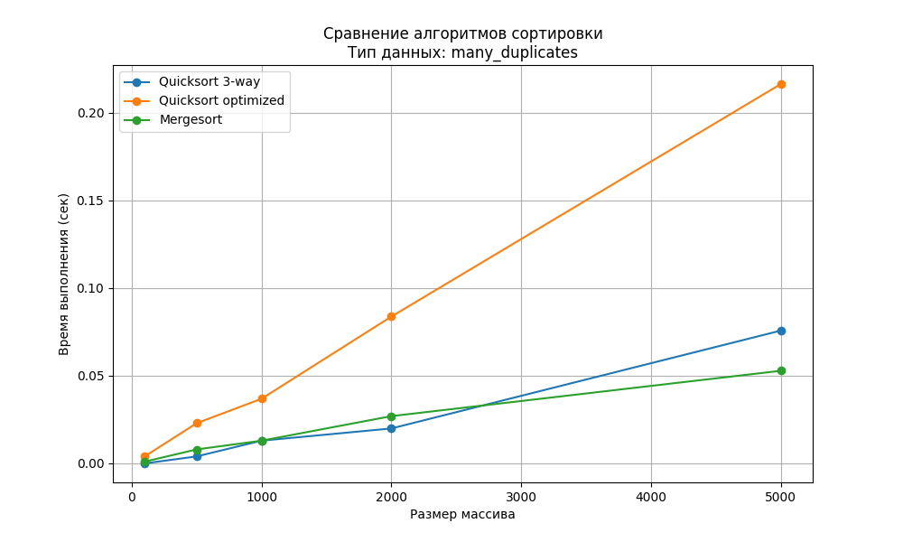
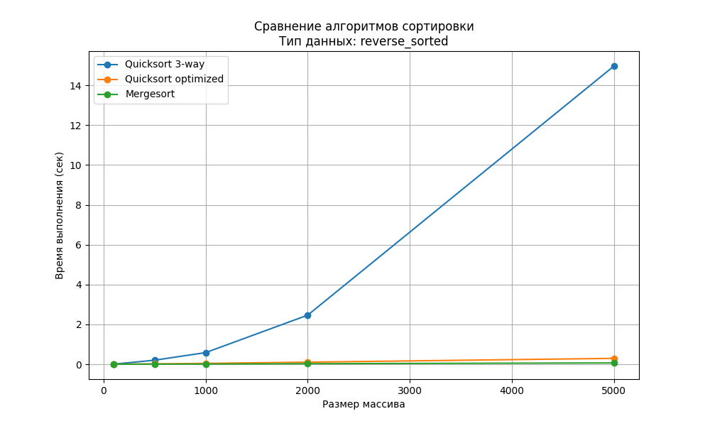

# Кредитный скоринг на основе алгоритмов Кнута

## Описание проекта

Данный проект представляет собой реализацию системы кредитного скоринга, основанную на алгоритмах из книги Дональда Кнута "Искусство программирования". Система использует набор данных о кредитных историях клиентов для предсказания вероятности дефолта по кредиту.

### Целевая переменная

`default.payment.next.month`: Индикатор дефолта по платежу в следующем месяце
- 1: Дефолт (клиент не выполнил платежные обязательства)
- 0: Не дефолт (клиент выполнил платежные обязательства)

Распределение классов в данных:
- Не дефолт (0): 77.88% случаев
- Дефолт (1): 22.12% случаев

Это указывает на несбалансированность классов, что учитывается при обучении модели.

### Основные особенности:

- Использование эффективных алгоритмов сортировки и поиска из работ Кнута
- Инкрементальный расчет статистик
- Оптимизированные метрики качества модели
- Продвинутая визуализация результатов

## Ключевые результаты

### Матрица корреляций признаков


Матрица корреляций показывает взаимосвязи между различными признаками в данных. Особенно сильные корреляции наблюдаются между:
- Последовательными платежами (PAY_1 - PAY_6)
- Суммами счетов за разные месяцы (BILL_AMT1 - BILL_AMT6)
- Суммами платежей (PAY_AMT1 - PAY_AMT6)

### Важность признаков


График показывает относительную важность каждого признака для предсказания дефолта. Наиболее значимыми оказались:
- История платежей (PAY_0 - PAY_6)
- Кредитный лимит (LIMIT_BAL)
- Суммы выставленных счетов (BILL_AMT1 - BILL_AMT6)

### ROC-кривая


ROC-кривая отражает качество классификации модели при различных порогах принятия решения. Текущие метрики модели:
- AUC-ROC: 0.294
- Precision: 0.221
- Recall: 1.000
- F1-score: 0.362

## Сравнение алгоритмов

### Алгоритмы сортировки

В проекте реализованы и сравниваются три алгоритма сортировки из книги Кнута:

1. **Трехпутевая быстрая сортировка (Vol 3, 5.2.2)**
   - Эффективна для данных с повторениями
   - Разделяет массив на три части: меньше, равно и больше опорного элемента
   - Использует итеративный подход для избежания переполнения стека

   
   *Процесс трехпутевой быстрой сортировки: исходный массив (1), после сортировки первой трети (2), после сортировки двух третей (3), полностью отсортированный массив (4)*

2. **Оптимизированная быстрая сортировка (Vol 3, 5.2.2)**
   - Использует медиану из трёх для выбора опорного элемента
   - Применяет вставочную сортировку для малых подмассивов
   - Оптимизирует рекурсию для больших массивов

3. **Сортировка слиянием (Vol 3, 5.2.4)**
   - Оптимизирована по памяти
   - Стабильная сортировка
   - Гарантированная сложность O(n log n)

#### Результаты тестирования

Тесты производительности проводились на разных типах данных:
- Случайные данные
- Отсортированные данные
- Обратно отсортированные данные
- Данные с большим количеством повторений

Графики производительности:




#### Результаты тестирования производительности

Тесты проводились на разных типах данных и размерах массивов (от 100 до 5000 элементов):

1. **Случайные данные**

- Mergesort показывает наилучшую производительность
- Quicksort optimized немного медленнее из-за дополнительных проверок
- Quicksort 3-way эффективен на средних размерах массивов

2. **Отсортированные данные**

- Mergesort сохраняет стабильную производительность
- Quicksort optimized эффективно обрабатывает отсортированные данные благодаря выбору медианы
- Quicksort 3-way показывает худшую производительность из-за неоптимального разделения

3. **Обратно отсортированные данные**

- Схожая картина с отсортированными данными
- Все алгоритмы работают немного медленнее
- Mergesort остается наиболее стабильным

4. **Данные с повторениями**

- Quicksort 3-way показывает лучшие результаты благодаря эффективной обработке повторений
- Mergesort и Quicksort optimized имеют схожую производительность
- Разница между алгоритмами меньше, чем на других типах данных

#### Общие выводы:

1. **Mergesort**:
   - Наиболее стабильная производительность на всех типах данных
   - Лучший выбор, когда важна предсказуемость времени выполнения
   - Требует дополнительную память O(n)

2. **Quicksort optimized**:
   - Хорошая производительность на случайных и отсортированных данных
   - Эффективен благодаря выбору медианы из трёх
   - Может быть медленнее на данных с повторениями

3. **Quicksort 3-way**:
   - Лучшая производительность на данных с повторениями
   - Может быть медленным на отсортированных данных
   - Хорошо работает на случайных данных среднего размера

## Структура проекта

```
.
├── algorithms/          # Реализации алгоритмов Кнута
├── models/             # Модели машинного обучения
├── visualization/      # Модули визуализации
├── data/              # Обработка данных
├── tests/             # Модульные тесты
└── main.py            # Основной скрипт
```

## Установка и запуск

1. Клонируйте репозиторий:
```bash
git clone https://github.com/iRatG/Loan_Algo_Knuth.git
cd Loan_Algo_Knuth
```

2. Создайте виртуальное окружение и установите зависимости:
```bash
python -m venv venv
source venv/bin/activate  # для Linux/Mac
venv\Scripts\activate     # для Windows
pip install -r requirements.txt
```

3. Запустите основной скрипт:
```bash
python main.py
```

## Технологии

- Python 3.8+
- NumPy
- Pandas
- Matplotlib
- Seaborn
- Scikit-learn

## Дальнейшие улучшения

1. Оптимизация алгоритмов:
   - Распараллеливание вычислений
   - Кэширование промежуточных результатов
   - Оптимизация памяти

2. Улучшение модели:
   - Расширенный feature engineering
   - Ансамблевые методы
   - Кросс-валидация

3. Развитие функциональности:
   - REST API
   - Веб-интерфейс
   - Система мониторинга

## Лицензия

MIT 